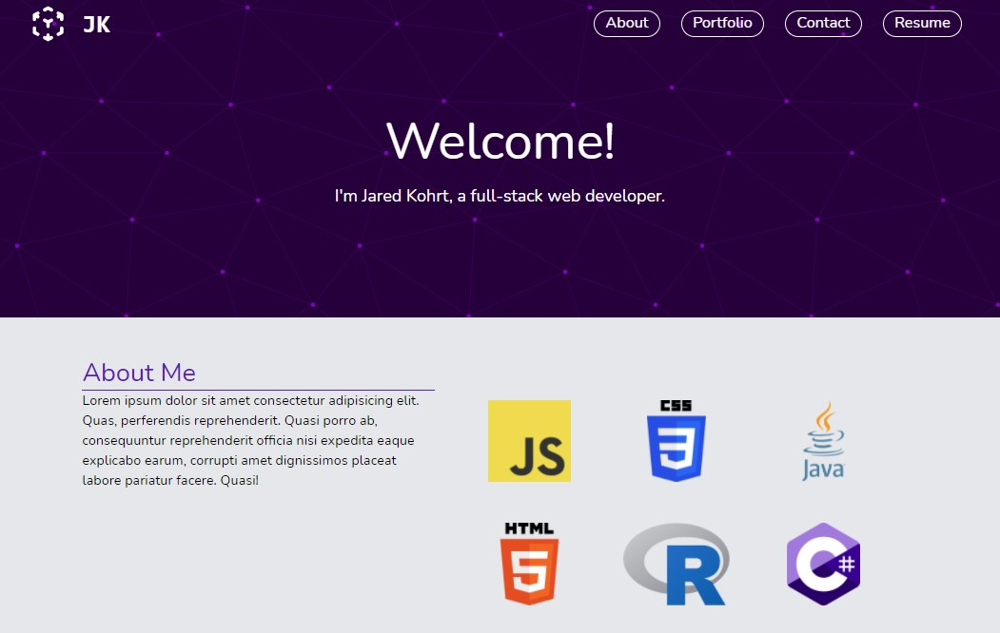

# Test-Portfolio_V2
The second iteration of my portfolio page, this time created with TailwindCSS.

## Usage
The webpage is hosted on github pages and can be viewed here:  https://jkohrt7.github.io/Test-Portfolio_V2/

The page was designed to work on various screen sizes, so try messing with the window size!




## Requirements and Installation
If you're interested in downloading/cloning the project, you'll need a couple things:

- [node.js](https://nodejs.org/en/) 
- tailwindCSS

Tailwind can be installed with the following command after you've installed node.js:
```
npm install -D tailwindcss@latest postcss@latest autoprefixer@latest
```

...and that's it! Now you can see and edit the configuration files this project uses. Use ```node run build-css``` to apply any changes.

## Credits
- [TailwindCSS](https://tailwindcss.com/)
- [SVGBackgrounds](https://www.svgbackgrounds.com/)
- [HeroIcons](https://heroicons.com/)

## License
[MIT](./LICENSE)
